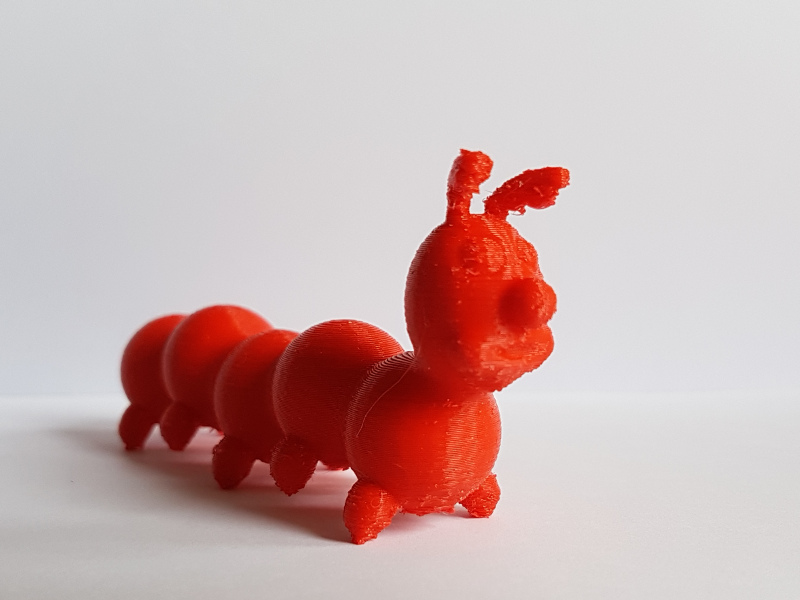

FabMoments of Loïc Fejoz
========================

A repositories of various thing, [I](http://www.fejoz.net) am building.
I am also on twitter [@loic_fejoz](https://twitter.com/loic_fejoz).

* [Calavera](calavera), A cavalera is a skull for Halloween.
* [Knight helmet](casque-chevalier), A laser-cut 2D knight helmet.
* [carbon nanotube](carbon-nanotube), A model of a Carbon nanotube.
* [lithophane](lithophane), an image 3D printed in very thin translucent way, that can been seen only with light source behind.
* [millepattes](millepattes), a 3D model of a centipede based on procedural implicit distance functions
* [flocons](flocons), simple paper cut of snow flakes.
* [castle](castle), a simple procedural modeling of castle with random stones, and a slight warp shader within IceSL.
* [Couillard](couillard), a kind of trebuchet.
* [Pneubotics Maze](pneubotics-maze), an activity for kids to explain soft robots principles.
* [Gabriel's Horn](gabriel-horn), usage of implicit surface within IceSL.
* [Twisted Torus](icesl-gallery), a gallery of models create with IceSL.
* [Dolphin](dolphin), a model easily designed with FabInPocket
* [Tin Whisthle](tinwhistle)
* See also [my work on our FabLab's wiki](http://wiki.nybi.cc/index.php/Utilisateur:Loic.fejoz)

