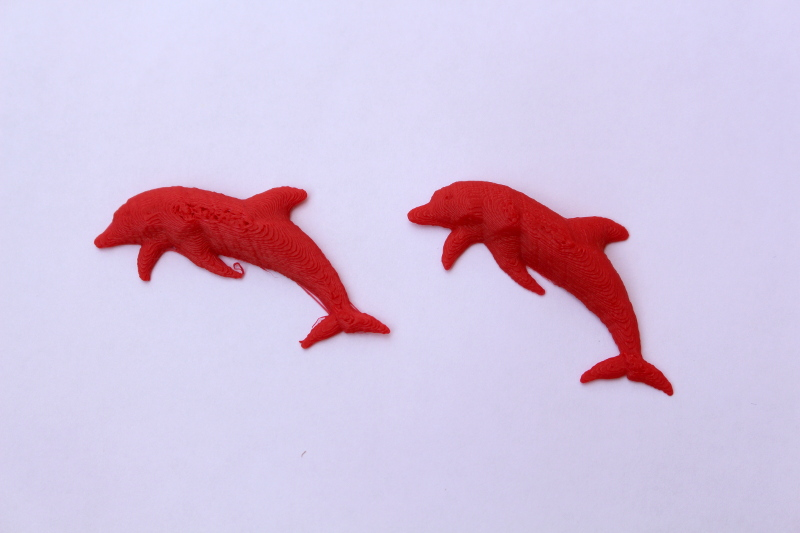

Dolphin
===========

A simple try to print and CNC a dolphin model designed with [FabInPocket](http://loic-fejoz.github.io/fabinpocket/).

Source
------

Download the [drawing forFabInPocket](dauphin.png?raw=true), [STL 3D model](dauphin-binary.stl?raw=true) or [fork on github](https://github.com/loic-fejoz/loic-fejoz-fabmoments/tree/master/dolphin).

See other of [my FabMoments](https://github.com/loic-fejoz/loic-fejoz-fabmoments/tree/master/).

License
-------

STL, PNG and Photos are under the [Creative Commons Attribution 3.0 France](https://creativecommons.org/licenses/by/3.0/fr/) (CC BY 3.0 FR - Loïc Fejoz).

IceSL Model is under the [MIT License](http://opensource.org/licenses/MIT).

Gallery
-------

