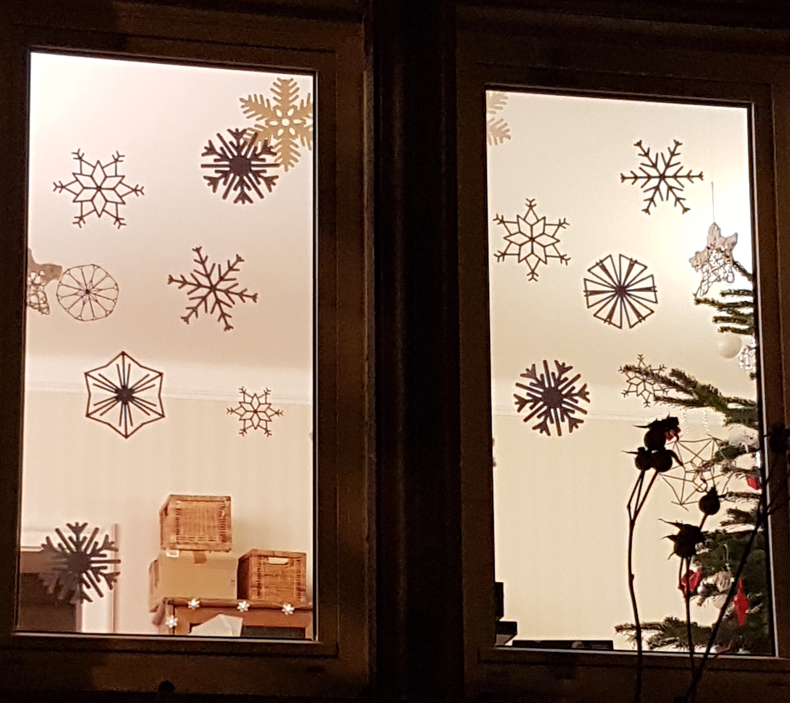

Flocons
=======

Mes enfants se sont amusés à faire des flocons grace à l'éditeur du [calendrier de l'avent Jacquie Lawson](https://www.jacquielawson.com/advent).
Après un export en image, je peux les rendre réels avec [ma découpeuse Silhouette Portrait](http://silhouettefr.fr/silhouette_portrait.html) afin de décorer ma fenêtre.

Source
------

Download or [fork on github](https://github.com/loic-fejoz/loic-fejoz-fabmoments/tree/master/flocons).

See other of [my FabMoments](https://github.com/loic-fejoz/loic-fejoz-fabmoments/tree/master/).

License
-------

Studio3 and Photos files are under the [Creative Commons Attribution 3.0 France](https://creativecommons.org/licenses/by/3.0/fr/) (CC BY 3.0 FR - Loïc Fejoz).

Gallerie
--------

