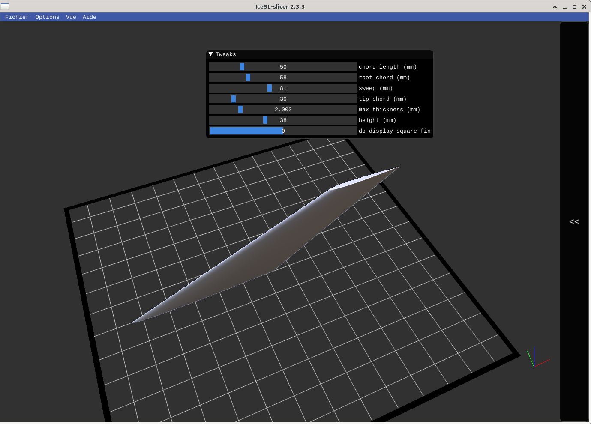
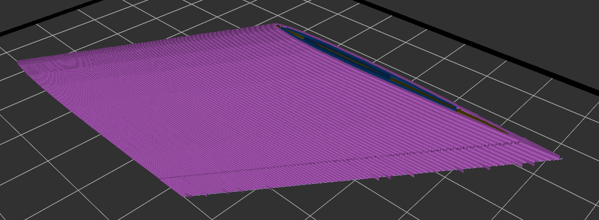
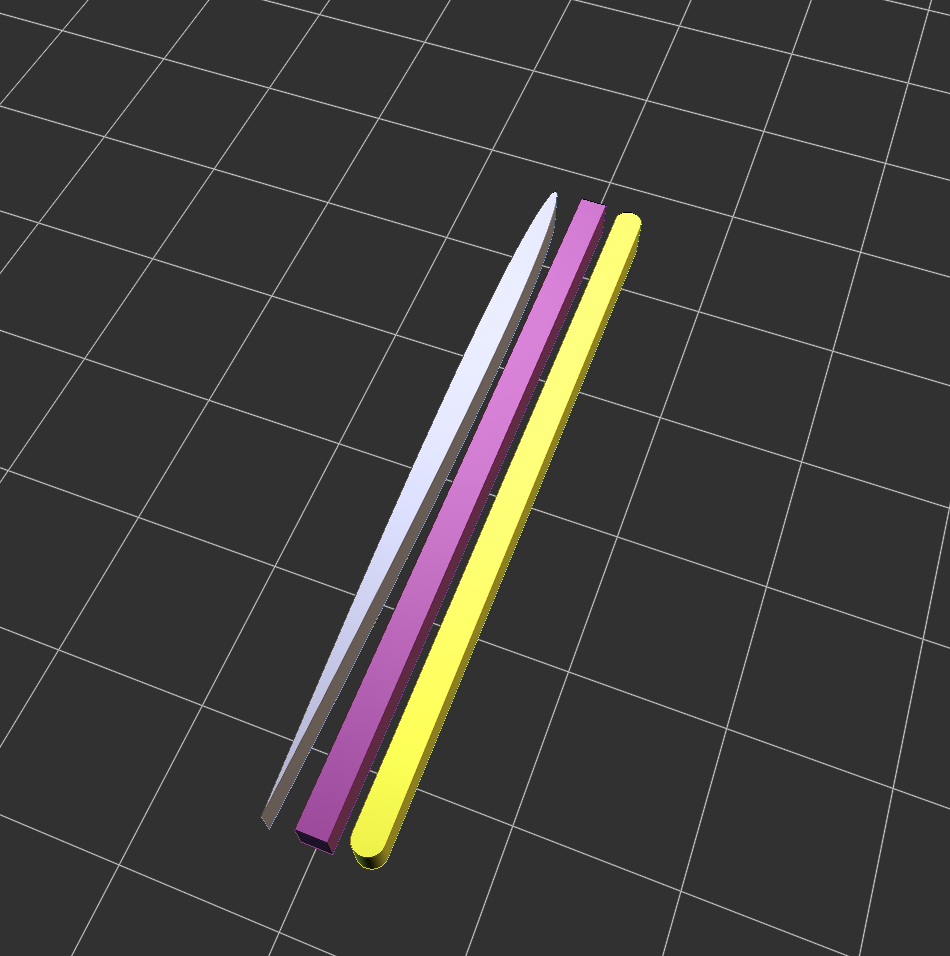
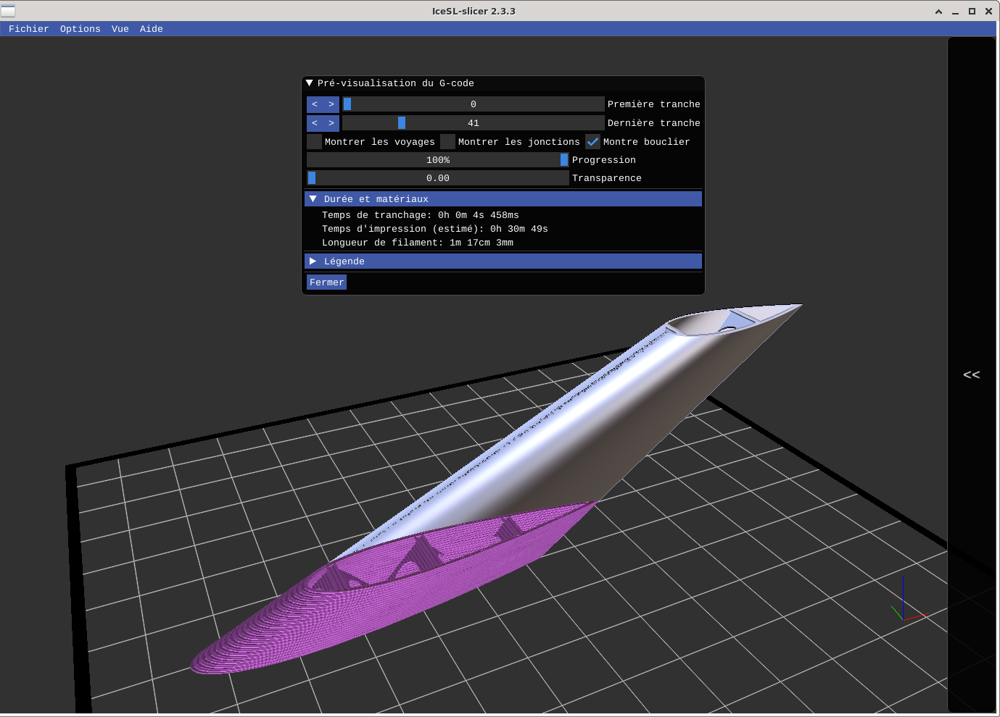

NACA Airfoil
============

A generator of different airfoil profiles, especially symmetrical [NACA profiles](https://en.wikipedia.org/wiki/NACA_airfoil) ([french](https://fr.wikipedia.org/wiki/Profil_NACA)).

## Generic Trapezoid NACA Airfoil generator

The goal is to understand what it takes to generate a trapezoid NACA Airfoil as specified within [OpenRocket](http://openrocket.info), a model rocket simulator.

## NACA 004

Here is a 50mm chord length, 2mm thick, NACA 0004 airfoil:

## Internal structures

Following [a discussion on the IceSL forum](https://groups.google.com/forum/?utm_medium=email&utm_source=footer#!topic/icesl/ThOFP15VhO0), there is a trial at providing internal structures suitable for RC planes model.

## Source

Download the [IceSL source or fork on github](https://github.com/loic-fejoz/loic-fejoz-fabmoments/tree/master/naca-airfoil).

See other of [my FabMoments](https://github.com/loic-fejoz/loic-fejoz-fabmoments/tree/master/).

## License

Photos and Screenshots are under the [Creative Commons Attribution 3.0 France](https://creativecommons.org/licenses/by/3.0/fr/) (CC BY 3.0 FR - Loïc Fejoz).

IceSL Models are under the [MIT License](http://opensource.org/licenses/MIT).
