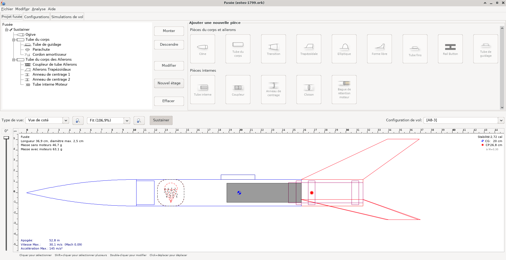
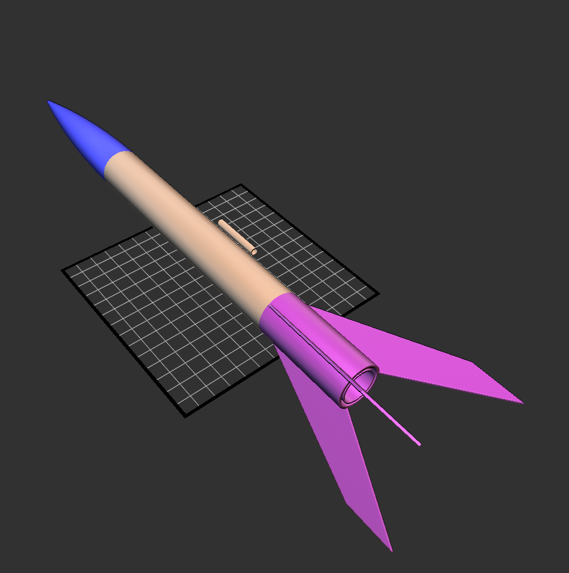
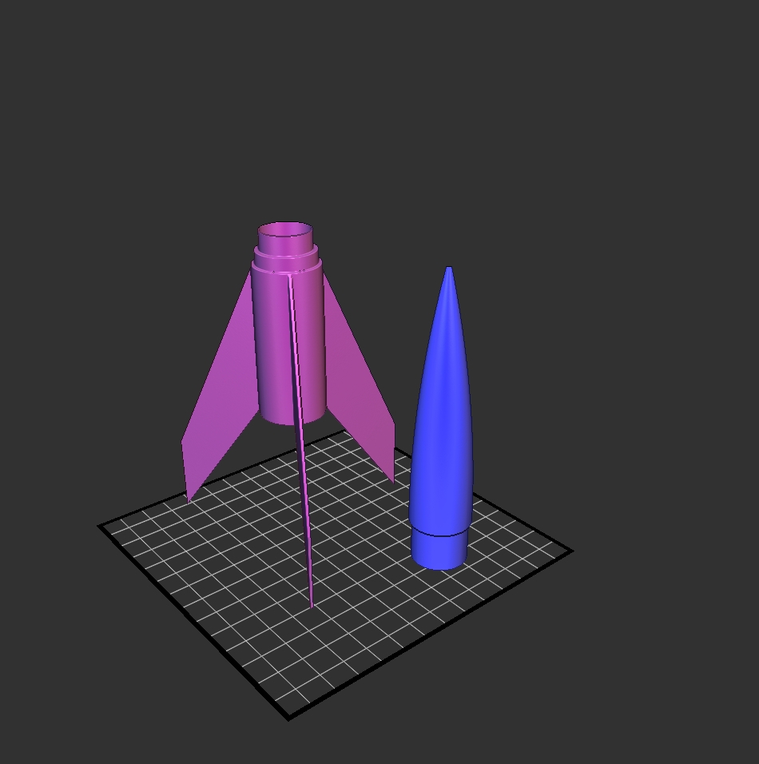
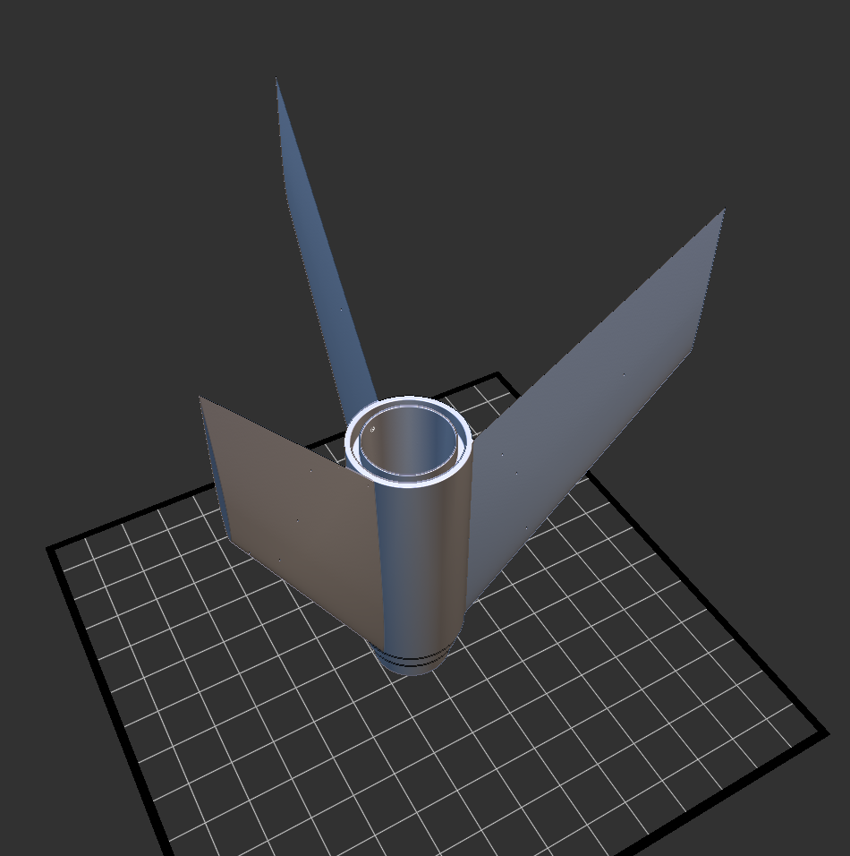

Model Rocket
============

Along with [my fork of OpenRocket](https://github.com/loic-fejoz/openrocket/tree/icesl-export), this is an project for testing what it would take to 3D print a model rocket as design in [OpenRocket](openrocket.info/) (a model rocket simulator).

The fun part is the modeling of the different kind of ogive with `implicit_solid`. The modeling of the [NACA airfoil](../naca-airfoil) was interesting too.

Also I believe that the [generated STL](test-marching-0_2.stl) might be used for finite-element simulation in order to compute drag.

Look how this one as an airfoil profile instead of a square one as in the second image.

## Source

Download the [IceSL source or fork on github](https://github.com/loic-fejoz/loic-fejoz-fabmoments/tree/master/openrocket).

See other of [my FabMoments](https://github.com/loic-fejoz/loic-fejoz-fabmoments/tree/master/).

## License

Photos and Screenshots are under the [Creative Commons Attribution 3.0 France](https://creativecommons.org/licenses/by/3.0/fr/) (CC BY 3.0 FR - Loïc Fejoz).

IceSL Models are under the [MIT License](http://opensource.org/licenses/MIT).
